# Ergo Keyboards

Monorepo for ZMK keyboard firmware configs:

- Urchin
- Corne
- GO60
- Glove80

The current migration preserves each keyboard's existing keymap first. Shared-keymap inheritance will be layered on top after the monorepo build path is stable.

## Generate Keymaps

The initial generator mirrors the copied source keymaps into `keymap/generated/` so CI can detect drift while the inheritance model is introduced.

```bash
node tools/generate-keymaps.mjs --all
node tools/generate-keymaps.mjs --all --check
```

## Generate SVGs

SVGs render one shared keymap layer on the superset layout. Colored margins show the physical regions used by Urchin, Corne, and GO60; Glove80 is the full superset.

```bash
node tools/generate-keymap-svgs.mjs --all
node tools/generate-keymap-svgs.mjs --all --check
nix-build -A keymapSvgs -o generated-keymaps
```

Generated diagrams are written directly under `docs/keymaps/`, one file per logical layer.

## Keymap Diagrams

The generated SVG diagrams are checked in as documentation for the keyboard family. Regenerate them with `node tools/generate-keymap-svgs.mjs --all` after changing keymaps or layout geometry.

HRM helper layers such as pinky, ring, middle, and index are generated under `docs/keymaps/` but omitted here because they add noise to the overview.

### HRM macOS

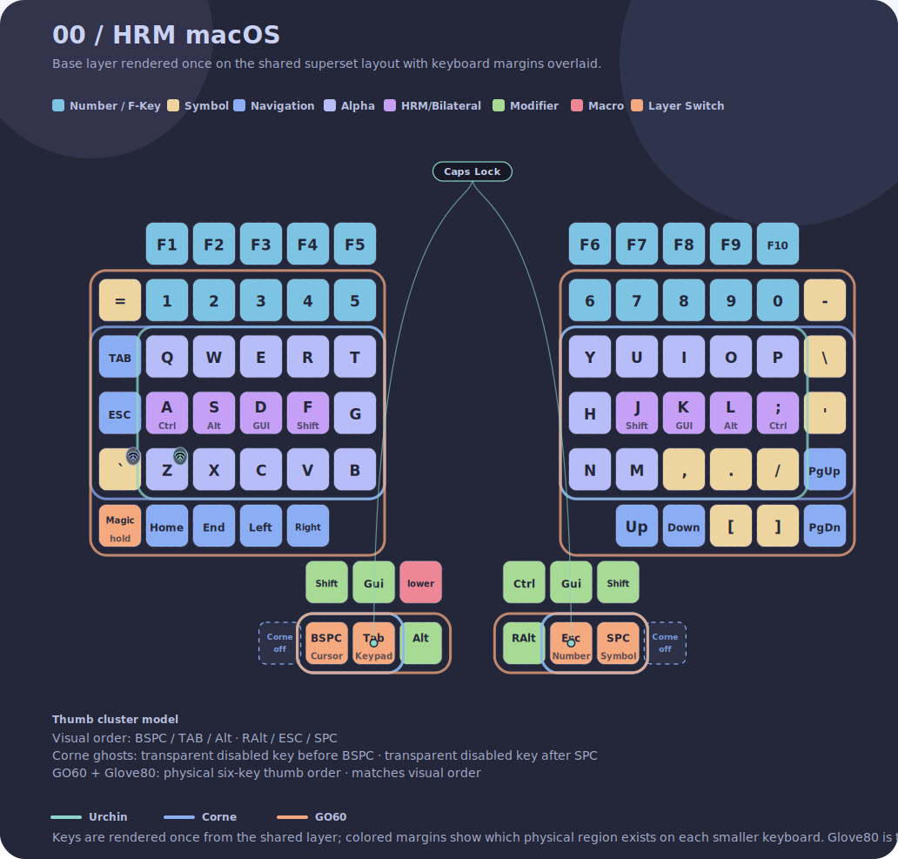

### Typing

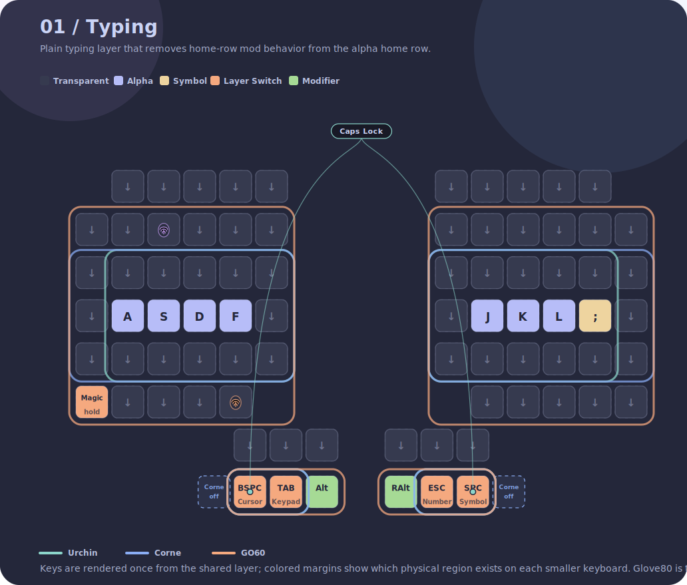

### Autoshift

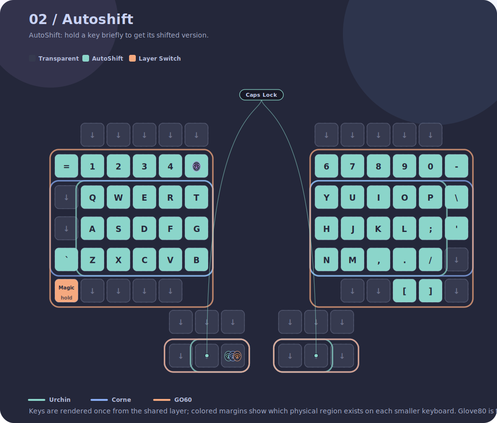

### Cursor

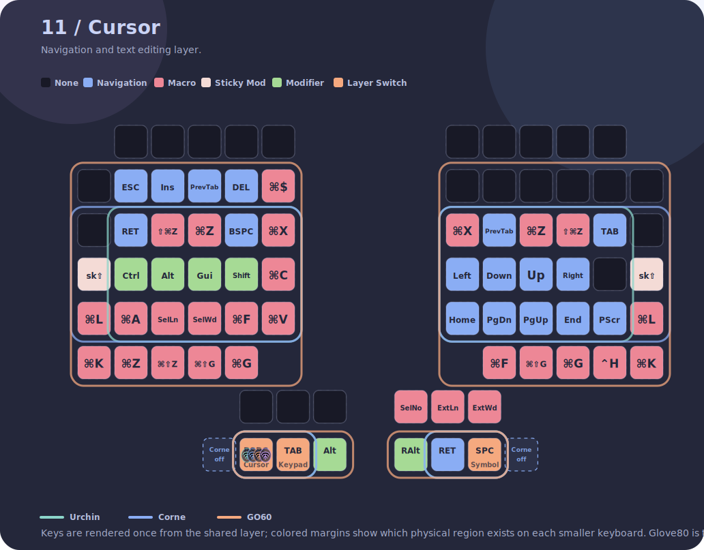

### Keypad

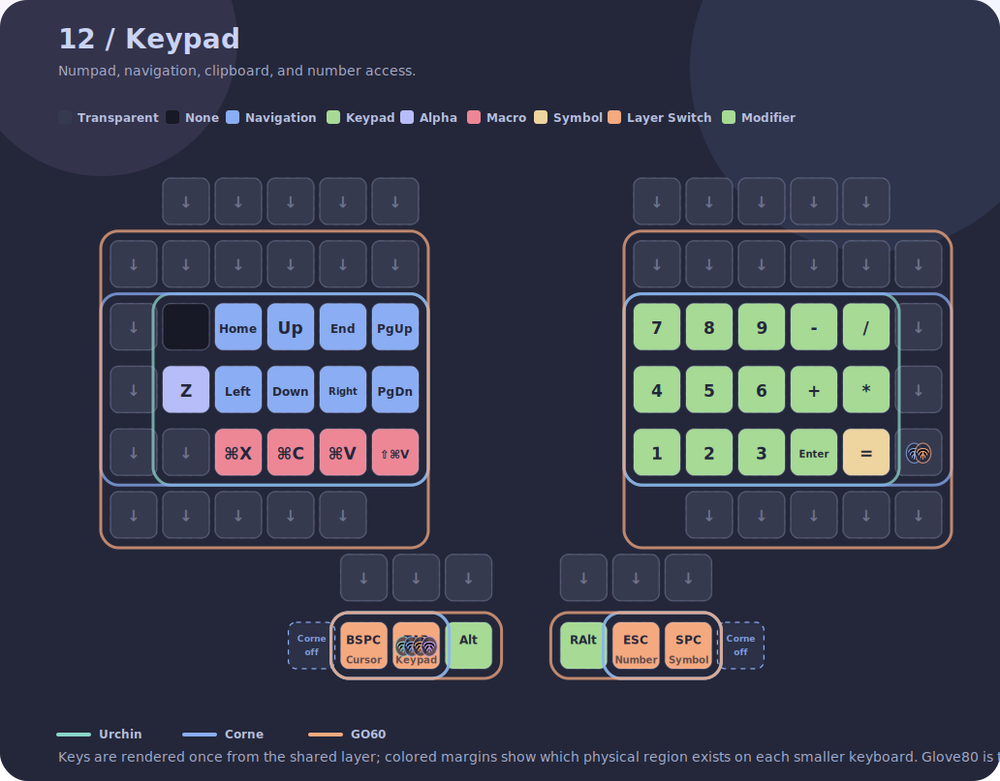

### Symbol

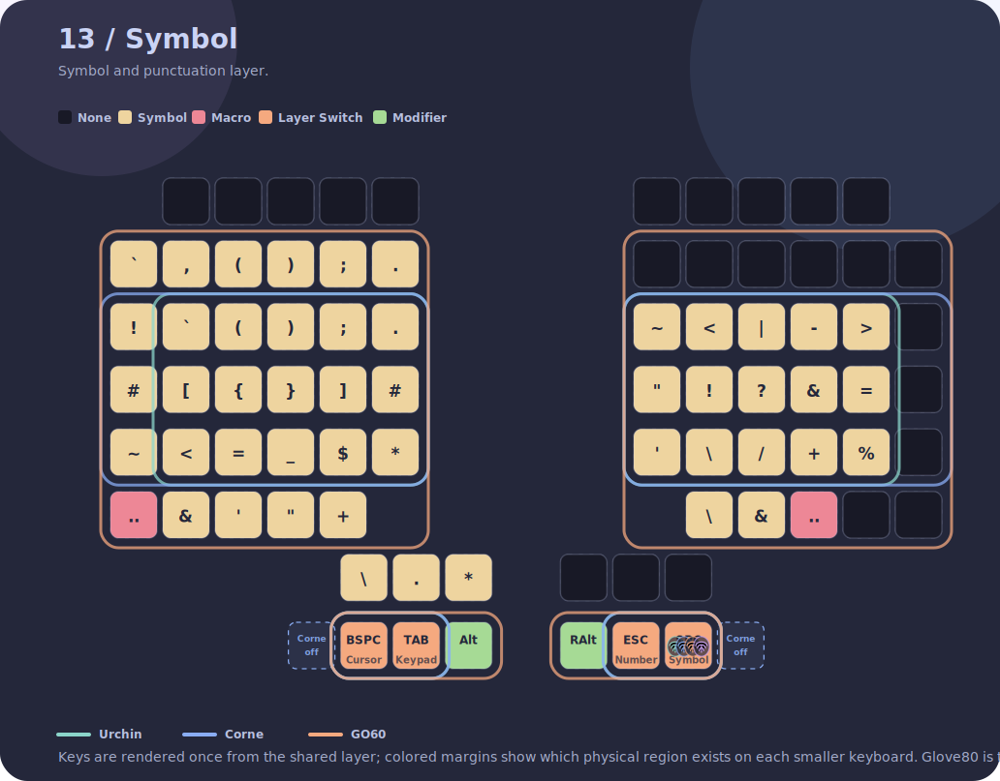

### Mouse

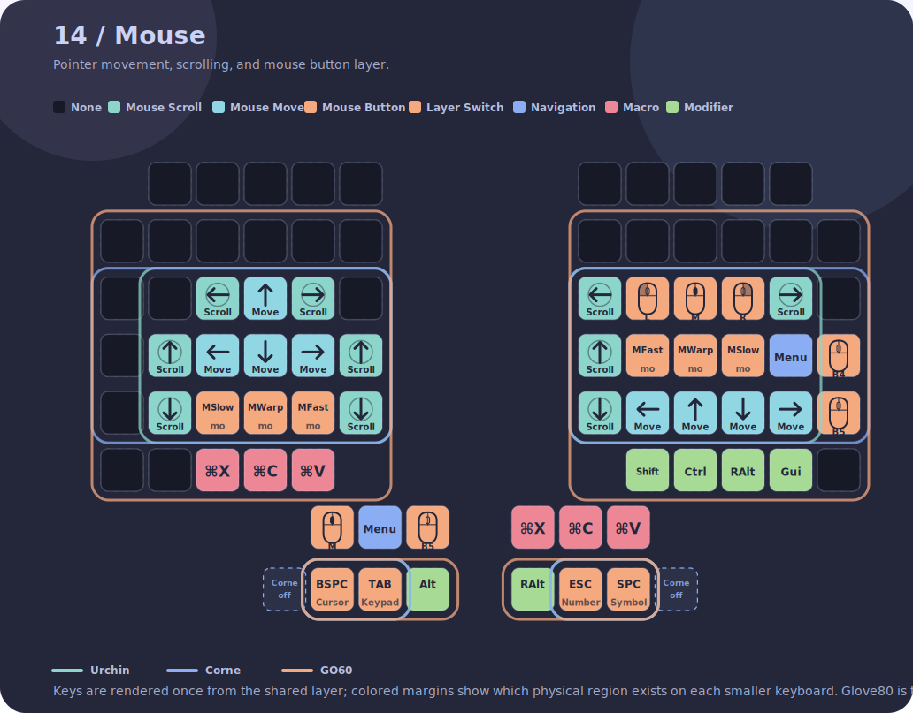

### Mouse Slow

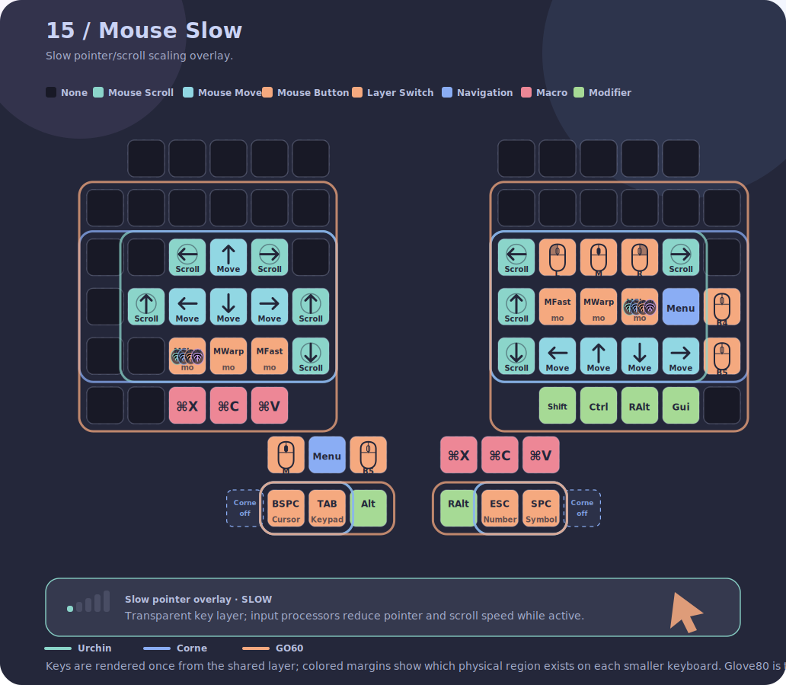

### Mouse Fast


### Mouse Warp

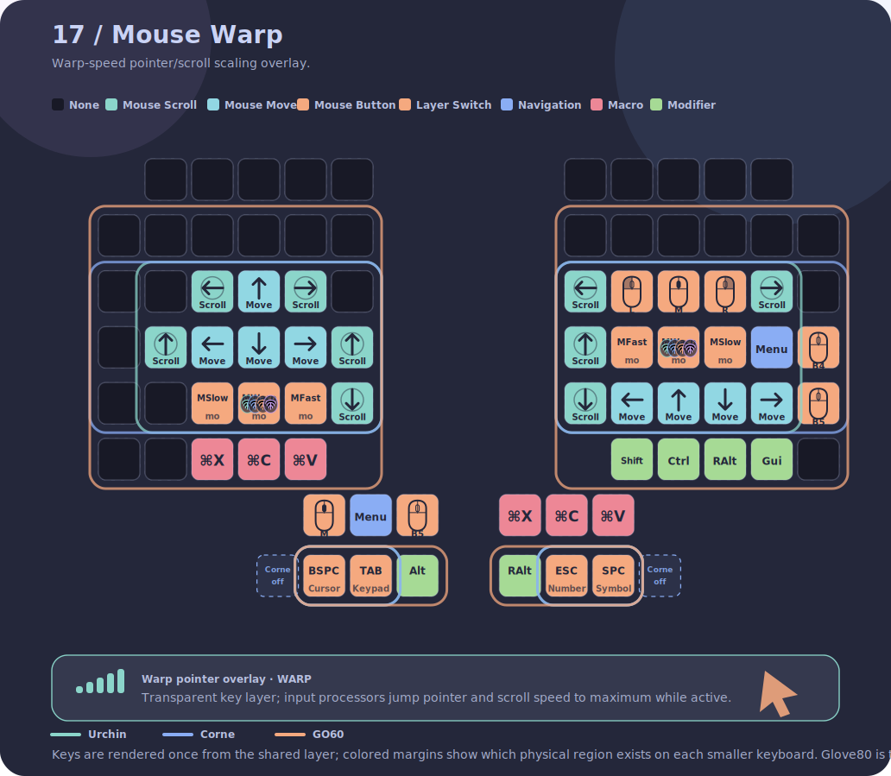

### Lower

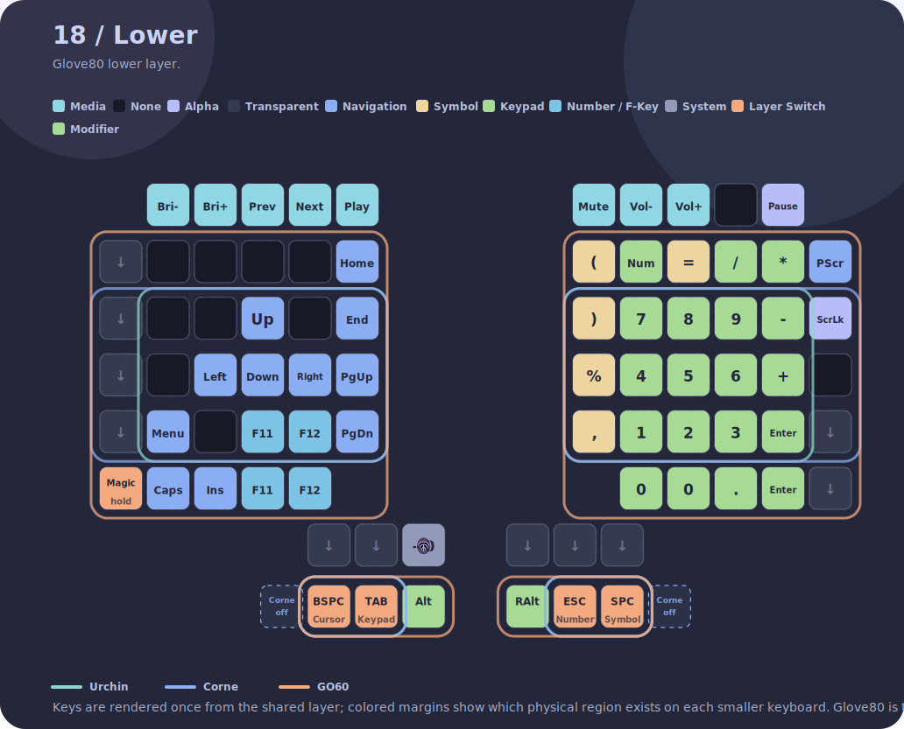

### Magic

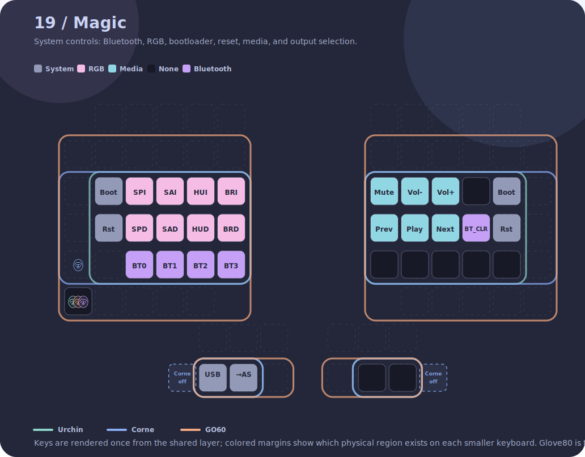

### Number

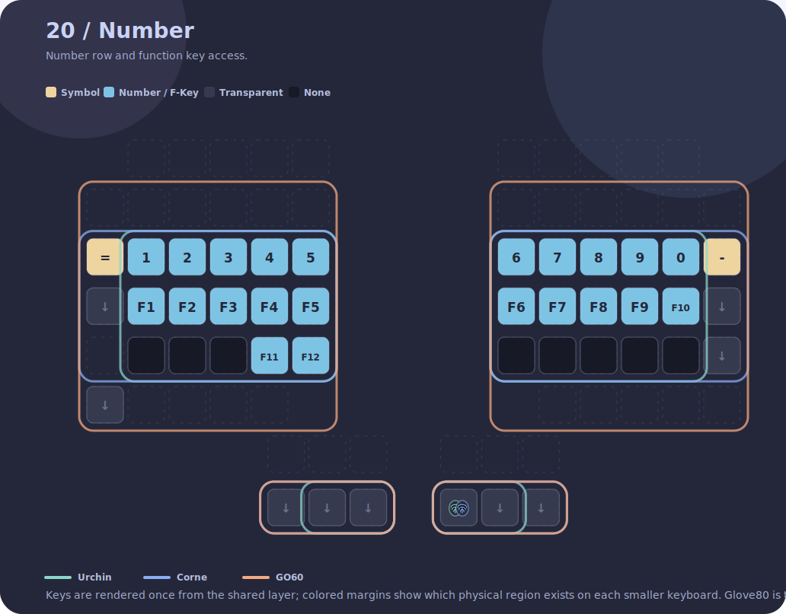

## Nix Builds

This repo uses legacy `nix-build`, matching MoErgo's current build style.

```bash
nix-build -A checks -o checks
nix-build -A go60
nix-build -A glove80
nix-build -A corne_left
nix-build -A corne_right
nix-build -A urchin_left
nix-build -A urchin_right
nix-build -A all
nix-build -A ci -o ci-build
```

`default.nix` uses `./src` when present for the MoErgo ZMK source, matching CI. If `./src` is missing, it fetches `moergo-sc/zmk` from `main`.

`nix-build -A checks -o checks` runs generated keymap checks, generated SVG checks, and Urchin parity verification. `nix-build -A ci -o ci-build` runs the checks, regenerates SVGs in a Nix output, and builds the firmware bundle.

GitHub Actions creates or updates an automated PR from `ci/regenerate-keymap-svgs` when Nix-generated SVGs differ from committed `docs/keymaps/*.svg` on trusted `push` or manual runs. Pull requests still fail the SVG check instead of pushing changes into contributor branches.

## Build Outputs

`nix-build -A all -o firmware` should produce:

- `firmware/go60.uf2`
- `firmware/glove80.uf2`
- `firmware/corne_left.uf2`
- `firmware/corne_right.uf2`
- `firmware/urchin_left.uf2`
- `firmware/urchin_right.uf2`
- `firmware/settings_reset.uf2`

## Keymap Inheritance Target

Planned inheritance order:

```text
urchin -> corne -> go60 -> glove80
```

The magic key remains keyboard-specific. Other keys inherit from the previous keyboard unless overridden.
